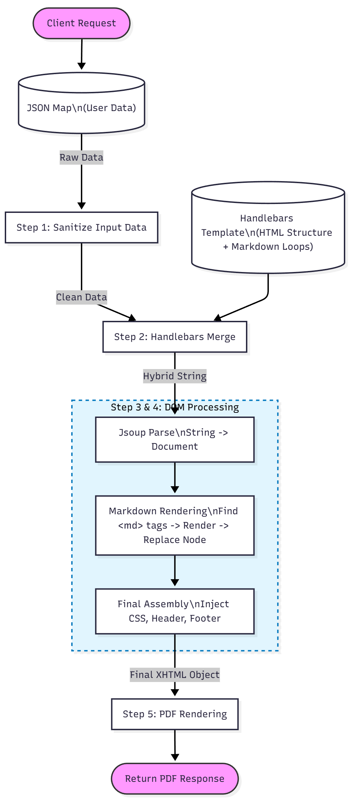

# Java Hybrid Document Generator

## Project Overview
This application is a specialized microservice that generates high-fidelity PDFs using a **template-first hybrid** approach. It combines strict HTML/CSS layout control with **Markdown** for dynamic, user-friendly content formatting.

### Core Philosophy
- **Layout is HTML:** Headers, footers, columns, and page breaks are handled by Handlebars-driven HTML templates.
- **Content is Markdown:** Dynamic text, lists, and tables stay as Markdown for clean data loops without brittle string concatenation.

## Architecture Pipeline

The service follows a strict **5-stage pipeline** to ensure security and formatting compliance:

1) **Sanitization:** User input is recursively scrubbed with `Jsoup.clean()` to prevent XSS before processing.
2) **Templating (Handlebars):** Data merges into the HTML structure; loops expand while embedded content remains raw Markdown.
3) **DOM Processing (Jsoup & Flexmark):**
    - Parse the hybrid string into a Jsoup `Document`.
    - Locate custom `<md>` tags.
    - Render the enclosed Markdown to HTML via Flexmark.
    - Replace each `<md>` node in place with the rendered HTML nodes.
4) **Assembly:** CSS, headers, and footers are injected directly into the DOM to ensure valid XHTML syntax for the renderer.
5) **Rendering (iText7):** The strict XHTML is converted to a PDF binary.

## Recent Updates

### v3.0: PDF Engine Migration (iText7)
- **Previous Engine:** `xhtmlrenderer` (Flying Saucer).
- **Current Engine:** `iText7 html2pdf`.
- **Benefit:** Migrated to a modern, actively maintained library with significantly improved CSS support (including Flexbox and Grid), better font handling, and enhanced performance.

### v2.0: Performance Refactor (Regex vs. DOM)
- **Previous:** Regex to find `<md>` blocks, then separate render + string concatenation to rebuild HTML (fragile and slow on large inputs).
- **Current:** Single-pass parse into a Jsoup object model; traverse to replace `<md>` elements in place.
- **Benefit:** Faster execution, lower memory overhead (no duplicate string buffers), and higher robustness against malformed tags.

## Technical Details & Constraints

### CSS Compliance
- **Engine:** `iText7 html2pdf`.
- **Support:** Excellent support for modern CSS standards, including **Flexbox and Grid layouts**. This removes the previous limitations of CSS 2.1, allowing for more complex and responsive designs within the PDF.

### Static Asset Handling (Images, Fonts)
- The service now automatically resolves relative paths for images. Place your assets in [src/main/resources/static/](cci:7://file:///C:/projects/flexMarkProject/src/main/resources/static:0:0-0:0).
- An `` tag in your template will be correctly located and embedded in the final PDF, whether running locally or from a packaged JAR.

### HTML Requirements
- **Strict XHTML:** All HTML tags must be well-formed and closed (e.g., ` `, not ` `). The Jsoup assembly step enforces this automatically before rendering.