# Java Hybrid Document Generator

## Table of Contents
- [Project Overview](#project-overview)
- [Quick Start](#quick-start)
- [Architecture Pipeline](#architecture-pipeline)
- [API Reference](#api-reference)
- [Image Handling](#image-handling)
- [Technical Details](#technical-details--constraints)
- [Error Handling & Logging](#error-handling--logging)
- [Common Issues & Solutions](#common-issues--solutions)
- [Recent Updates](#recent-updates)

## Project Overview
This application is a specialized microservice that generates high-fidelity PDFs using a **template-first hybrid** approach. It combines strict HTML/CSS layout control with **Markdown** for dynamic, user-friendly content formatting.

### Core Philosophy
- **Layout is HTML:** Headers, footers, columns, and page breaks are handled by Handlebars-driven HTML templates.
- **Content is Markdown:** Dynamic text, lists, and tables stay as Markdown for clean data loops without brittle string concatenation.

## Quick Start

### API Endpoint
```
POST /api/content/submit
Content-Type: application/json
```

### Request Example
```json
{
  "templateEncoded": "base64EncodedTemplate",
  "cssEncoded": "base64EncodedCSS",
  "headerEncoded": "base64EncodedHeaderWithEmbeddedImages",
  "footerEncoded": "base64EncodedFooterWithEmbeddedImages",
  "docPropertiesJsonData": {
    "title": "My Document",
    "items": [
      {"name": "Item 1", "value": 100},
      {"name": "Item 2", "value": 200}
    ]
  }
}
```

**Note:** Images should be embedded directly in the HTML using data URIs:
```html

```

### Response
- **Success (200 OK):**
  - **Content-Type:** `application/pdf`
  - **Body:** PDF binary stream
  - **Disposition:** `inline; filename=generated_report.pdf`

- **Error Responses:**
  - **400 Bad Request:** Invalid input (null request, missing required fields, invalid Base64 encoding)
    - Error message provides specific details about the validation failure
  - **500 Internal Server Error:** Processing errors (template compilation failures, PDF generation errors)
    - Error messages include context for debugging

### Minimal Example
```java
GenerateRequestDto request = new GenerateRequestDto();
request.setTemplateEncoded(Base64.getEncoder().encodeToString(templateHtml.getBytes()));
request.setCssEncoded(Base64.getEncoder().encodeToString(css.getBytes()));
request.setDocPropertiesJsonData(Map.of("title", "Hello World"));

// POST to /api/content/submit
// Returns PDF binary
```

## Architecture Pipeline

### Visual Flowchart

```mermaid
flowchart TD
    Start([API Request<br/>POST /api/content/submit]) --> Validate[Stage 1: Input Validation]
    
    Validate --> ValidateRequest{Request<br/>valid?}
    ValidateRequest -->|Invalid| Error1[Return 400<br/>IllegalArgumentException]
    ValidateRequest -->|Valid| ValidateTemplate{templateEncoded<br/>provided?}
    ValidateTemplate -->|Missing| Error2[Return 400<br/>Template Required]
    ValidateTemplate -->|Valid| Decode[Stage 2: Input Decoding]
    
    Decode --> DecodeTemplate[Decode templateEncoded<br/>Base64 → HTML]
    Decode --> DecodeCSS[Decode cssEncoded<br/>Base64 → CSS]
    Decode --> DecodeHeader[Decode headerEncoded<br/>Base64 → HTML]
    Decode --> DecodeFooter[Decode footerEncoded<br/>Base64 → HTML]
    Decode --> DecodeImage[Decode imageEncoded<br/>Base64 → Image Data]
    Decode --> GetData[Extract docPropertiesJsonData<br/>Trusted Server-Side Data]
    
    DecodeTemplate --> ImageCheck{imageEncoded<br/>provided?}
    DecodeCSS --> ImageCheck
    DecodeHeader --> ImageCheck
    DecodeFooter --> ImageCheck
    DecodeImage --> ImageCheck
    GetData --> ImageCheck
    
    ImageCheck -->|Yes| ImagePreProcess[Stage 3: Image Pre-Processing]
    ImageCheck -->|No| Handlebars[Stage 4: Templating Handlebars]
    
    ImagePreProcess --> ValidateImage[Validate Image Type<br/>PNG/JPG/SVG only]
    ValidateImage -->|Valid| ProcessHeader[Process Header HTML<br/>Replace img src with data URI]
    ValidateImage -->|Invalid| FallbackStatic[Use Static Images<br/>from resources/static/]
    ProcessHeader --> ProcessFooter[Process Footer HTML<br/>Replace img src with data URI]
    ProcessFooter --> Handlebars
    FallbackStatic --> Handlebars
    
    Handlebars --> MergeData[Merge docPropertiesJsonData<br/>into Handlebars Template]
    MergeData --> ExpandLoops["Expand Loops & Conditionals<br/>Handlebars #each, #if, etc."]
    ExpandLoops --> HybridOutput[Output: Hybrid HTML/Markdown<br/>Template structure + Raw Markdown]
    
    HybridOutput --> DOMParse[Stage 5: DOM Processing<br/>Parse with Jsoup]
    DOMParse --> FindMDTags[Locate &lt;md&gt; tags<br/>in Document]
    FindMDTags --> RenderMarkdown[Render Markdown to HTML<br/>via Flexmark Parser]
    RenderMarkdown --> ReplaceInPlace[Replace &lt;md&gt; nodes<br/>with rendered HTML in-place]
    ReplaceInPlace --> PureHTML[Output: Pure HTML DOM<br/>All Markdown converted]
    
    PureHTML --> Assembly[Stage 6: Assembly & Image Processing]
    Assembly --> InjectCSS[Inject CSS into &lt;head&gt;<br/>from cssStr]
    InjectCSS --> InjectFooter[Inject Footer into &lt;body&gt;<br/>prepend footerStr]
    InjectFooter --> InjectHeader[Inject Header into &lt;body&gt;<br/>prepend headerStr]
    
    InjectHeader --> ImageCheck2{imageEncoded<br/>provided?}
    ImageCheck2 -->|Yes| ProcessAllImages[Process All &lt;img&gt; Tags<br/>Replace src with data URIs]
    ImageCheck2 -->|No| EnforceXHTML[Enforce XHTML Compliance<br/>Auto-close tags, escape entities]
    ProcessAllImages --> EnforceXHTML
    
    EnforceXHTML --> ValidXHTML[Output: Valid XHTML DOM<br/>Ready for PDF Rendering]
    
    ValidXHTML --> PDFRender[Stage 7: Rendering iText7]
    PDFRender --> ConfigureProps[Configure ConverterProperties<br/>Set Base URI for static assets]
    ConfigureProps --> ConvertToPDF[HtmlConverter.convertToPdf<br/>XHTML → PDF Binary]
    ConvertToPDF --> PDFOutput[Output: PDF Binary Stream<br/>Content-Type: application/pdf]
    
    PDFOutput --> End([Response<br/>PDF Document])
    
    style Start fill:#2196F3,color:#fff
    style End fill:#4CAF50,color:#fff
    style Validate fill:#F44336,color:#fff
    style ValidateRequest fill:#E91E63,color:#fff
    style ValidateTemplate fill:#E91E63,color:#fff
    style Error1 fill:#FF5722,color:#fff
    style Error2 fill:#FF5722,color:#fff
    style ImageCheck fill:#FFC107,color:#000
    style ImageCheck2 fill:#FFC107,color:#000
    style ValidateImage fill:#FF9800,color:#fff
    style FallbackStatic fill:#FF9800,color:#fff
    style Decode fill:#607D8B,color:#fff
    style ImagePreProcess fill:#009688,color:#fff
    style Handlebars fill:#9C27B0,color:#fff
    style DOMParse fill:#00BCD4,color:#fff
    style Assembly fill:#3F51B5,color:#fff
    style PDFRender fill:#E91E63,color:#fff
```



> **Note:** For a static image version, see [flexmark_flowchart.png](./flowchart/flexmark_flowchart.png)

### Pipeline Stages

The service follows a strict **5-stage pipeline** to ensure formatting compliance and robust error handling:

| Stage | Process | Output |
|-------|---------|--------|
| **1. Input Validation** | Validate request object is not null; ensure `templateEncoded` is provided and not empty (Jakarta Bean Validation) | Validated request or error response |
| **2. Input Decoding** | Decode Base64-encoded inputs (template, CSS, header, footer); handle decoding errors gracefully | Raw HTML/CSS strings (with embedded data URI images) |
| **3. Templating (Handlebars)** | Merge data into HTML structure; loops expand while content remains raw Markdown | Hybrid HTML/Markdown string |
| **4. DOM Processing** | Parse hybrid string → locate `<md>` tags → render Markdown → replace in-place; inject CSS/headers/footers | Valid XHTML DOM |
| **5. Rendering (iText7)** | Convert XHTML to PDF binary with secure resource retrieval (data URIs allowed, HTTP/HTTPS blocked) | PDF stream |

> **Note:** Input sanitization is not performed as `docPropertiesJsonData` originates from server-side sources and is considered trusted. This design decision improves performance and preserves formatting flexibility.

### Key Pipeline Details

**Stage 1 - Input Validation:**
- Jakarta Bean Validation at controller layer with `@Valid` annotation
- Validates that `templateEncoded` is not blank
- Returns 400 Bad Request with validation error details before reaching service layer
- Prevents processing invalid requests early in the pipeline

**Stage 2 - Input Decoding:**
- Decodes all Base64-encoded inputs (template, CSS, header, footer)
- Images are already embedded as data URIs in the HTML (e.g., ```)
- No separate image processing required

**Stage 3 - Templating:**
- Data from `docPropertiesJsonData` is merged into the Handlebars template
- Loops and conditionals expand while embedded Markdown content remains raw
- Result is a hybrid HTML/Markdown string
- Template compilation errors are caught and logged with context

**Stage 4 - DOM Processing & Assembly:**
- Parse the hybrid string into a Jsoup `Document`
- Locate custom `<md>` tags and render enclosed Markdown to HTML via Flexmark
- Preserves blank lines for proper paragraph separation
- Replace each `<md>` node in place with the rendered HTML nodes
- Inject CSS, headers, and footers directly into the DOM
- Enforce XHTML syntax automatically for iText7 compatibility

**Stage 5 - Rendering:**
- Convert XHTML to PDF using iText7's HtmlConverter
- **Secure Resource Retrieval:** Custom `SecureDataUriResourceRetriever` implementation
  - ✅ Allows: Data URIs (Base64-encoded images) and local classpath resources
  - ❌ Blocks: External HTTP/HTTPS requests (SSRF protection)
- Data URIs are decoded and rendered natively by iText7
- Static resources loaded from `resources/static/` directory

## API Reference

### GenerateRequestDto

| Field | Type | Required | Description |
|-------|------|----------|-------------|
| `templateEncoded` | String | **Yes** | Base64-encoded HTML template with Handlebars syntax. Must not be null or empty. Validated with `@NotBlank` annotation. |
| `cssEncoded` | String | No | Base64-encoded CSS styles |
| `headerEncoded` | String | No | Base64-encoded HTML header. May contain `` tags with data URI images embedded in `src` attributes. |
| `footerEncoded` | String | No | Base64-encoded HTML footer. May contain `` tags with data URI images embedded in `src` attributes. |
| `docPropertiesJsonData` | Map<String, Object> | No | Dynamic data for Handlebars templating (server-side, trusted source). Defaults to empty map if null. |

> **Note:** The service uses Jakarta Bean Validation. Invalid requests (missing or blank `templateEncoded`) will automatically return a 400 Bad Request with validation error details before reaching the service layer. This provides faster feedback and clearer error messages.

### Template Syntax

**Handlebars Variables:**
```handlebars
<h1>{{title}}</h1>
<p>Generated on {{date}}</p>
```

**Handlebars Loops:**
```handlebars
{{#each items}}
  <div class="item">
    <md>
    ## {{name}}
    Value: {{value}}
    </md>
  </div>
{{/each}}
```

**Markdown Blocks:**
Wrap dynamic Markdown content in `<md>` tags:
```html
<md>
## Section Title
- Item 1
- Item 2

| Column 1 | Column 2 |
|----------|----------|
| Data 1   | Data 2   |
</md>
```

## Image Handling

### Overview
Images are embedded in HTML using **data URIs** (Base64-encoded). Due to iText7 limitations with data URIs in headers/footers, the service **automatically extracts** data URI images and converts them to temporary files for reliable PDF rendering.

### Data URI Format
Images should be embedded in `` tags using the data URI format:
```html

```

### Automatic Image Extraction

**How It Works:**
1. **Detection:** The service scans header/footer HTML for `` tags with data URI `src` attributes
2. **Extraction:** Base64 data is decoded and saved to `temp/images/` directory with UUID-based filenames
3. **Rewriting:** The `img src` attribute is rewritten to reference the file path (e.g., `temp/images/abc-123.jpg`)
4. **Rendering:** iText7 loads images from the file system for reliable PDF generation
5. **Cleanup:** Temporary files are automatically deleted on application shutdown via shutdown hook

**Example Transformation:**
```html
<!-- Input (in headerEncoded/footerEncoded): -->


<!-- After extraction: -->

```

### Supported Formats
- ✅ PNG: `data:image/png;base64,...` → `.png`
- ✅ JPEG: `data:image/jpeg;base64,...` → `.jpg`
- ✅ GIF: `data:image/gif;base64,...` → `.gif`
- ✅ WebP: `data:image/webp;base64,...` → `.webp`
- ✅ SVG: `data:image/svg+xml;base64,...` → `.svg`

### Usage in Templates

**Header/Footer with Images:**
```html
<!-- Header HTML (before Base64 encoding) -->
<div id="header">
    
    <h1>Company Report</h1>
</div>
```

Then Base64-encode the entire HTML and send in `headerEncoded` field. Images will be automatically extracted during processing.

**Template with Images:**
```handlebars
<div class="logo">
    
</div>
```

### Security: SSRF Protection

The service implements a **custom secure resource retriever** that:
- ✅ **Allows:** Local file URIs (for extracted images in `temp/images/`)
- ✅ **Allows:** Local classpath resources (`file://`, `jar:file:`)
- ❌ **Blocks:** External HTTP/HTTPS requests (prevents SSRF attacks)

Any attempt to load external resources via `http://` or `https://` will be blocked with an error.

### Temporary File Management

**Directory:** `temp/images/` (relative to application working directory)

**Lifecycle:**
- Created automatically when first image is extracted
- Files persist during application runtime
- Automatically cleaned up on graceful shutdown via registered shutdown hook
- Add `temp/` to `.gitignore` to avoid committing temporary files

**Manual Cleanup:**
If the application is forcefully terminated (Ctrl+C without graceful shutdown), clean up manually:
```bash
rm -r temp
```

### Static Images (Optional)

For static assets that don't change:
- **Location:** Place files in `src/main/resources/static/`
- **Usage:** Reference with relative paths: ``
- **Works:** Both locally and in packaged JARs
- **Security:** Only local classpath resources are allowed

### Example

```java
// Convert image to data URI
byte[] imageBytes = Files.readAllBytes(Paths.get("logo.png"));
String base64Image = Base64.getEncoder().encodeToString(imageBytes);
String dataUri = "data:image/png;base64," + base64Image;

// Create footer HTML with embedded image
String footerHtml = """
    <div id="pdf-footer">
        <table style="width: 100%;">
            <tr>
                <td style="text-align: left;">
                    
                </td>
                <td style="text-align: right;">
                    Page <span class="page-number"></span>
                </td>
            </tr>
        </table>
    </div>
    """.formatted(dataUri);

// Base64 encode the footer HTML
String footerEncoded = Base64.getEncoder().encodeToString(footerHtml.getBytes(StandardCharsets.UTF_8));

// Send in request
GenerateRequestDto request = new GenerateRequestDto();
request.setFooterEncoded(footerEncoded);
// Image will be automatically extracted and rendered in the PDF
```

## Recent Updates

### v6.0: Simplified Architecture & Native Data URI Support
- **Architecture Simplification:**
  - Removed manual image injection logic from `MarkdownService`
  - Removed `imageEncoded` field from `GenerateRequestDto`
  - Eliminated ~250 lines of complex image processing code (methods: `processImagesInDocument`, `processHtmlWithImage`, `createDataUri`, `decodeImage`, `determineImageMimeType`, `isSupportedImageType`, `matchesSignature`, `extractBase64Data`)
  - Removed image-related constants (MIME types, magic bytes, HTML markers)
- **Native Data URI Support:**
  - Images are now embedded directly in HTML using data URIs: ``
  - iText7 natively handles data URIs - no custom processing required
  - Simpler client integration: construct HTML with embedded images before Base64 encoding
- **Security Enhancement:**
  - Implemented custom `SecureDataUriResourceRetriever` with SSRF protection
  - **Allows:** Data URIs (Base64-encoded images) and local classpath resources
  - **Blocks:** External HTTP/HTTPS requests to prevent Server-Side Request Forgery attacks
  - Provides clear error messages when blocked resources are attempted
- **Improved Pipeline:**
  - Reduced from 7 stages to 5 stages (removed image pre-processing and post-processing stages)
  - Cleaner, more maintainable codebase with fewer moving parts
  - Better performance: no DOM traversal for image replacement
- **Breaking Change:**
  - Clients must now embed images as data URIs in HTML before sending to the API
  - The `imageEncoded` field has been removed from the DTO
  - Migration: Convert `imageEncoded` to data URI and embed in `headerEncoded`/`footerEncoded`
- **Benefit:** Dramatically simplified architecture, better security, native iText7 data URI handling, and clearer client responsibility for image encoding.

### v5.1: Code Cleanup & Validation Improvements
- **Dependency Cleanup:**
  - Removed unused Flying Saucer (xhtmlrenderer) dependency left over from v3.0 migration
  - Removed unused FlexmarkConfig class that was not properly registered as a Spring bean
  - Added spring-boot-starter-validation for Jakarta Bean Validation support
- **DTO Improvements:**
  - Removed unused fields (`filePath`, `templateName`) from GenerateRequestDto
  - Added `@NotBlank` validation annotation to `templateEncoded` field
  - Added comprehensive JavaDoc documentation to all DTO fields
  - Controller now uses `@Valid` annotation for automatic validation
- **Bug Fixes:**
  - **Critical:** Fixed Markdown processing bug that was removing blank lines. Blank lines are now properly preserved as they're significant in Markdown for paragraph separation
  - Fixed Base64 regex pattern to handle whitespace/newlines that commonly appear in real-world Base64 strings
- **Code Cleanup:**
  - Removed commented-out sanitization code and related unused imports
  - Cleaned up unused method `sanitizeInputData()` for better code clarity
- **Validation Error Handling:**
  - Spring Boot now automatically returns 400 Bad Request with validation error details when `templateEncoded` is missing or blank
  - Validation errors are returned before reaching the service layer, improving performance and error clarity
- **Benefit:** Cleaner codebase, smaller dependency footprint, better validation with clear error messages, and critical bug fix for Markdown paragraph handling.

### v5.0: Code Quality & Performance Improvements
- **Input Validation:** Enhanced validation with explicit null checks and required field validation. The service now validates that:
  - Request object is not null
  - `templateEncoded` field is required and cannot be empty
  - Provides clear error messages for invalid inputs
- **Error Handling:** Improved exception handling with:
  - More descriptive error messages that include context
  - Proper exception chaining for debugging
  - Graceful fallback behavior with logging
- **Logging:** Added comprehensive SLF4J logging throughout the pipeline:
  - Debug logs for pipeline stages and processing details
  - Warning logs for fallback scenarios and non-critical failures
  - Error logs with full exception context for troubleshooting
- **Performance Optimizations:**
  - Optimized markdown processing using `Collectors.joining()` instead of reduce operations
  - Improved string handling with better blank line preservation
  - More efficient image processing with shared validation logic
- **Code Quality:**
  - Eliminated code duplication between image processing methods
  - Extracted reusable methods for better maintainability
  - Added constants for magic strings and MIME types
  - Improved method organization and separation of concerns
- **Benefit:** More robust error handling, better debugging capabilities, improved performance, and easier maintenance.

### v4.0: Dynamic Image Processing
- **Feature:** Support for Base64-encoded images via `GenerateRequestDto.imageEncoded` field.
- **Capabilities:**
  - Class-agnostic image processing that works with templates, headers, and footers.
  - Automatic image type validation (only `.png`, `.jpg`/`.jpeg`, and `.svg` are supported).
  - Intelligent fallback to static images from `resources/static/` when no encoded image is provided or validation fails.
- **Processing Flow:** Images are processed at two stages:
  1. **Pre-injection:** Header and footer HTML strings are processed before DOM assembly.
  2. **Post-assembly:** Final DOM is processed to catch template images and dynamically generated content.
- **Benefit:** Enables dynamic branding and customization per document generation request while maintaining backward compatibility with static assets.

### v3.0: PDF Engine Migration (iText7)
- **Previous Engine:** `xhtmlrenderer` (Flying Saucer).
- **Current Engine:** `iText7 html2pdf`.
- **Benefit:** Migrated to a modern, actively maintained library with significantly improved CSS support (including Flexbox and Grid), better font handling, and enhanced performance.

### v2.0: Performance Refactor (Regex vs. DOM)
- **Previous:** Regex to find `<md>` blocks, then separate render + string concatenation to rebuild HTML (fragile and slow on large inputs).
- **Current:** Single-pass parse into a Jsoup object model; traverse to replace `<md>` elements in place.
- **Benefit:** Faster execution, lower memory overhead (no duplicate string buffers), and higher robustness against malformed tags.

## Technical Details & Constraints

### CSS Compliance
- **Engine:** `iText7 html2pdf`
- **Support:** Excellent support for modern CSS standards, including **Flexbox and Grid layouts**
- **Benefit:** Removes previous CSS 2.1 limitations, enabling complex and responsive PDF designs

### HTML Requirements
- **Strict XHTML:** All HTML tags must be well-formed and closed (e.g., `<br />`, not `<br>`)
- **Auto-Enforcement:** The Jsoup assembly step automatically enforces XHTML compliance before rendering
- **Validation:** Malformed HTML is corrected during the assembly stage

### Markdown Support
- **Extensions:** Tables, Attributes
- **Code Blocks:** Use triple backticks (```) instead of indented blocks
- **HTML in Markdown:** HTML tags in templates pass through (configured for template-first approach)

### Security Considerations
- **Input Sanitization:** Not performed on `docPropertiesJsonData` as it originates from trusted server-side sources
- **Template/CSS/Header/Footer:** These are Base64-encoded and decoded, but not sanitized as they are considered trusted server-side resources
- **Input Validation:**
  - The service uses Jakarta Bean Validation with `@Valid` and `@NotBlank` annotations
  - Required field validation happens at the controller layer before reaching business logic
  - Validates request structure and required fields to prevent processing invalid requests
  - Automatic 400 Bad Request responses for validation failures
- **Error Messages:** Error messages are designed to provide debugging information without exposing sensitive system details
- **Design Rationale:** Skipping sanitization improves performance and preserves formatting flexibility while maintaining security through controlled data sources and proper validation

### Error Handling & Logging

The service includes comprehensive error handling and logging:

- **Validation Errors:** Invalid requests return `IllegalArgumentException` with descriptive messages
- **Processing Errors:** Template compilation or PDF generation failures return `RuntimeException` with context
- **Logging:** All errors are logged with appropriate levels:
  - **DEBUG:** Pipeline stages, processing details, image counts
  - **WARN:** Fallback scenarios, non-critical processing failures
  - **ERROR:** Exceptions with full stack traces and context

**Logging Configuration:**
To enable debug logging for troubleshooting, configure your logging framework (e.g., Logback, Log4j2):
```properties
# application.properties or logback.xml
logging.level.com.flexmark.flexMarkProject.service.MarkdownService=DEBUG
```

### Common Issues & Solutions

| Issue | Cause | Solution |
|-------|-------|----------|
| `IllegalArgumentException: Request cannot be null` | Request object is null | Ensure request object is properly constructed |
| `IllegalArgumentException: Template is required` | `templateEncoded` is missing or empty | Provide a valid Base64-encoded template |
| `IllegalArgumentException: Invalid Base64 encoding` | Base64 string is malformed | Verify Base64 encoding is correct |
| Images not appearing | Invalid Base64 or unsupported format | Verify Base64 encoding, ensure PNG/JPG/SVG. Check logs for validation failures. |
| PDF generation fails | Malformed HTML | Ensure all tags are closed (`<br />` not `<br>`). Check error logs for details. |
| Markdown not rendering | Missing `<md>` tags | Wrap Markdown content in `<md>` tags |
| Template variables not replaced | Invalid Handlebars syntax | Check `{{variable}}` syntax and data map keys |
| CSS not applying | CSS not Base64 encoded | Ensure CSS is properly Base64 encoded in request |
| Processing silently fails | Check application logs | Enable DEBUG logging to see detailed pipeline execution |